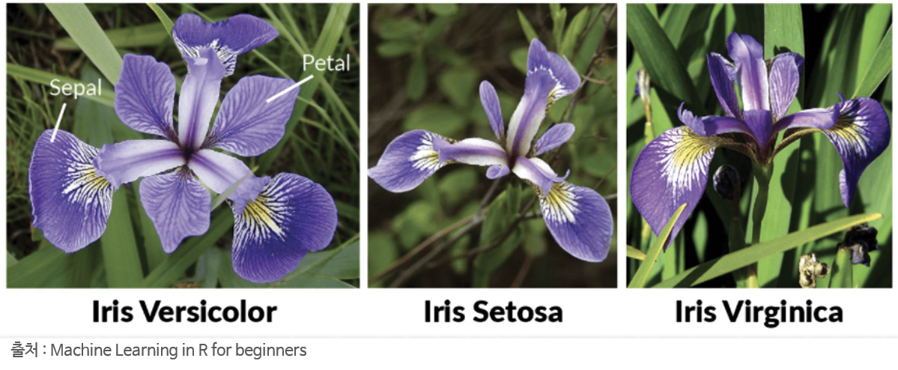

```{r setup, include=FALSE}
knitr::opts_chunk$set(
   echo = TRUE,
   message = FALSE,
   warning = FALSE
)
```


```{r, include=FALSE, echo=F}

pacman::p_load("dplyr")	

tbl_iris <- tbl_df(iris)
head(tbl_iris)


```


# **데이터 불러오기**

## **iris 데이터**


{width=45%}


* 1936년 Edger Anderson이 캐나다 동부 지역의 가스페 반도에 서식하는 붓꽃을 수집

* 같은 날에 세 가지 품종 (setosa, versicolor, verginica) 각각을 50송이씩 채취

* 같은 사람이 같은 자를 사용하여 꽃잎의 너비와 길이, 꽃받침의 너비와 길이를 측정

* R에 내장 데이터로 통계학자인 Ronald Fisher 교수가 논문에서 발표


```{r}
# iris
head(iris)
```

<br/>

|컬럼명|설명|
|:---|:---|
|Sepal.Length|꽃받침의 길이|
|Sepal.Width |꽃받침의 너비|
|Petal.Length|꽃잎의 길이|
|Petal.Width|꽃잎의 너비|
|Species|품종(versicoloer, setosa, virginica)|
|||


<br/>

## **tbl_df**

> **tbl 형태로 변환**

```{r}
pacman::p_load("dplyr")

tbl_iris <- tbl_df(iris)
head(tbl_iris)

```


tbl_df : 데이터 프레임 테이블 형태로 만들어줌.


<br/>


```{r}

iris$Sepal.Len


```


데이터 프레임에서 변수를 지정할 때는 기호 '$'를 사용.


---


# **데이터 유형 확인하기**


<br/>


## **class 확인**

```{r}

class(iris)

class(tbl_iris)

```

tbl_iris은 세가지 클래스로 정의되어 있어 좀 더 분석이 수월.


<br/>

## **str와 glimpse 비교**

```{r}

str(iris)

```


```{r}

pacman::p_load("dplyr")	

glimpse(iris)

```


두 함수 모두 데이터 구조를 확인하는 함수이지만 glimpse가 조금 더 잘 정렬되어 있고 콘솔 크기에 맞게 데이터가 출력 됨.


## **skim**

데이터 구조 + 요약된 값

```{r}

pacman::p_load("skimr")

skim(iris)

```

<br/>


## **dfSummary**

데이터 구조 + 요약된 값

```{r}

pacman::p_load("summarytools")

dfSummary(iris)

```


<br/>


# **과제**
1. USArrests 에 대해 skim과 dfSummary를 수행하라.