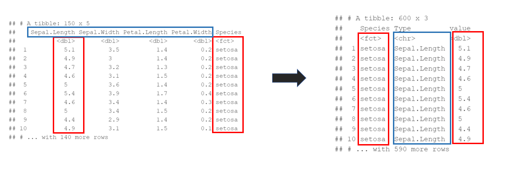

```{r setup, include=FALSE}
knitr::opts_chunk$set(
   echo = TRUE,
   message = FALSE,
   warning = FALSE
)
```


```{r, include=FALSE, echo=F}

pacman::p_load("dplyr")	

tbl_iris <- tbl_df(iris)
head(tbl_iris)


```


<br/>

---


# **tidyr패키지 : 열/행 조작**

tidyr는 tidy라는 영어 낱말 뜻(깔끔한, 잘 정돈한)처럼 자료 정제에 도움을 주는 패키지.


가장 기본이 되는 함수로는 gather, separate, unite, spread가 있음.

 
사용할 데이터로는 R 내장데이터인 iris데이터를 tibble형태로 바꾸어 사용.

```{r}

pacman::p_load("tidyr")	

tbl_iris <- tbl_df(iris)
head(tbl_iris)


```


## **gather**


gather() : 데이터의 가로와 세로를 변경하여 긴 형태로 전환하는 함수.


gather(data, key = "key", value = "value", ..., na.rm = FALSE,
  convert = FALSE, factor_key = FALSE)


gather(데이터, 변수명을 포함한 열의 신규 명칭, 값을 포함한 열의 신규 명칭, 긴 형태로 전환할 변수 리스트)


Sepal.Length **:** Petal.Width : Sepal.Length부터 Petal.Width까지 열의 값으로 채운다는 의미.

```{r}


gather(tbl_iris, Type, value, Sepal.Length : Petal.Width)


```




<br/>


## **spread**


spread() : 인덱스가 있는 데이터를 피벗 테이블로 전환하는 역할( gather과 반대되는 함수).


spread(data, key, value, fill = NA, convert = FALSE, drop = TRUE,sep = NULL)


spread(data, 나눌 변수, 나눌 변수의 값)


```{r}

mtcars_10 <- head(mtcars, 10) %>% print()
spread(mtcars_10, gear, mpg)

```

{width=60%}


<br/>


## **seperate**

seperate() : 데이터 값을 분리해주는 함수.


seperate(데이터, 분리할 칼럼명, 분리되는 신규 칼럼명)


```{r}

mtcars_name <- data.frame(Names = rownames(mtcars))
result <- separate(mtcars_name, Names, c("A", "B"), sep = " ", fill='right', extra='merge')
head(result)

```


<br/>


## **unite**


unite() : 분리된 칼럼을 다시 합쳐줌.


unite(data, col, ..., sep = "_", remove = TRUE, na.rm = FALSE)


unite(데이터, 합쳐 새로 생성될 칼럼명, 합칠 칼럼명1, 합칠 칼럼명2)


```{r}

mtcars_name <- unite(result, Names, A, B, sep=' ')
head(mtcars_name)

```


 


